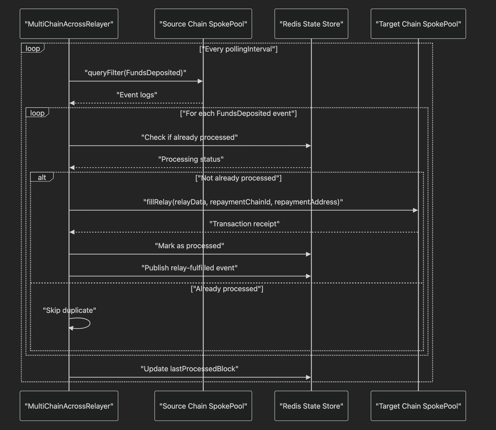
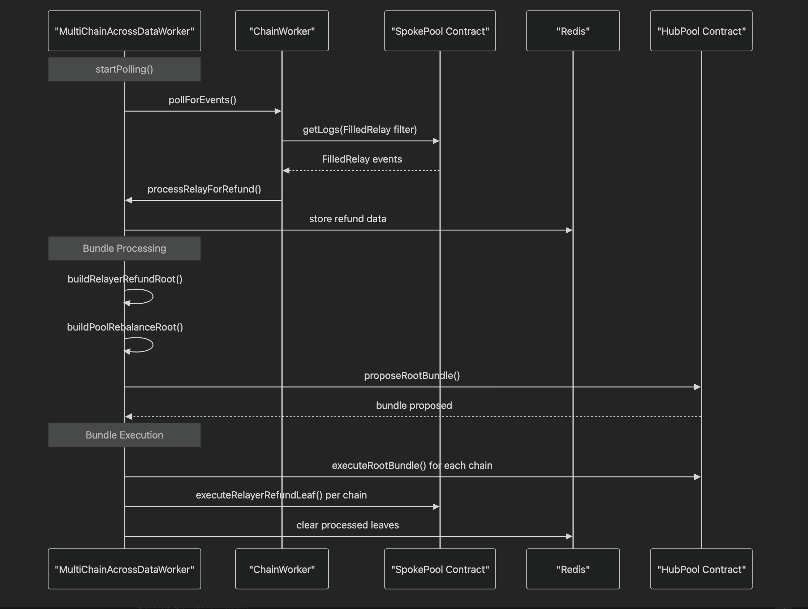
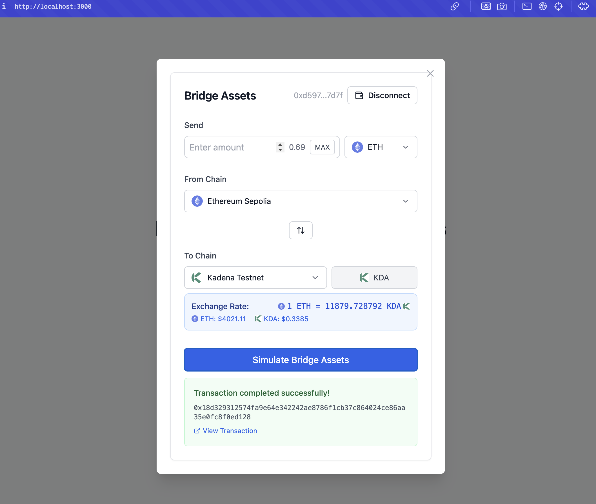

# KROSS - Cross-Chain Bridge Infrastructure

A modular cross-chain bridge system built with Across Protocol architecture, enabling seamless asset transfers across multiple blockchain networks through a hub-and-spoke model with automated contract deployment and offchain infrastructure.

## Overview

KROSS implements a comprehensive cross-chain solution that bridges multiple blockchain networks, allowing users to transfer assets between different chains efficiently and securely. The system uses a hub-and-spoke architecture where Ethereum serves as the central hub, with individual spoke pools deployed on each supported network.

### Key Features
- **Multi-chain Support**: Ethereum, Arbitrum, Optimism, Base, Polygon, BNB Chain, zkSync, Hedera, and Kadena
- **Automated Deployment**: Smart contract deployment across all supported chains with Kurtosis
- **Offchain Infrastructure**: Relayer and dataworker services for seamless cross-chain operations
- **Web UI**: Modern bridge interface for user-friendly cross-chain transactions
- **Testnet Ready**: Fully configured for testnet environments with proper token support

### Core Components

**Hub Pool**: Central liquidity pool deployed on Ethereum (mainnet/testnet) that manages cross-chain transfers and maintains the overall system state.

**Spoke Pools**: Individual pools deployed on each supported chain that handle deposits and withdrawals for that specific network.

**Relayer Service**: Offchain service that monitors deposit events across all chains and executes fills when deposits are detected, enabling fast cross-chain transfers.

**DataWorker Service**: Manages dispute resolution, merkle root updates, and maintains cross-chain data synchronization between the hub and spoke pools.

**Bridge UI**: Web-based interface that provides users with an intuitive way to initiate cross-chain transfers, check balances, and monitor transaction status.

## Quick Start

### 1. Deploy Infrastructure
```bash
kurtosis run github.com/0xBloctopus/across-package
```

This command will:
- Deploy all necessary smart contracts across configured networks
- Set up relayer and dataworker services
- Launch the bridge UI
- Configure Redis for state management

### 2. Configure Networks
Edit `network_params.yaml` to specify your target networks:

```yaml
networks:
  - name: "Ethereum Sepolia"
    type: "ethereum_sepolia"
    chain_id: "11155111"
    rpc: https://sepolia.infura.io/v3/...
    private_key: 0x...
  
  - name: "Kadena Testnet"
    type: "kadena"
    chain_id: "testnet04"
    rpc: https://api.testnet.chainweb.com
    private_key: 0x...

dataworker:
  network_type: "ethereum_sepolia"
  chain_id: "11155111"
  hubpool_rpc: https://sepolia.infura.io/v3/...

deploy_contract: true
```

### 3. Test Cross-Chain Transfer
```bash
# Test transfer from Ethereum to Kadena
./e2e_deposit.sh a2b

# Test transfer from Kadena to Ethereum  
./e2e_deposit.sh b2a
```

## Services

### Relayer Service
Monitors `DepositV3` events on all configured chains and executes fills when deposits are detected, enabling fast cross-chain transfers.



**Key Functions:**
- Monitors deposit events across all chains
- Executes fills when deposits are detected
- Manages cross-chain token transfers
- Handles repayment and fee collection

### DataWorker Service
Manages dispute resolution, merkle root updates, and cross-chain data synchronization to maintain system integrity.



### Bridge UI Service


**Key Functions:**
- Monitors HubPool for new merkle roots
- Manages dispute resolution processes
- Updates spoke pools with new merkle roots
- Handles refund processing and maintains cross-chain state consistency

### Redis Service
Provides shared state management between relayer and dataworker services, ensuring coordinated operations across the system.

## Commands

### Package Management
```bash
# Deploy the entire infrastructure
kurtosis run github.com/0xBloctopus/across-package

# Stop all services
kurtosis service stop <service-name>
```

### Token Operations
```bash
# Fund relayer with WETH for operations
./services/fund_weth.star

# Swap ETH to USDC for testing
./services/swap_tokens.star

# Approve tokens for SpokePool interaction
./services/approve_tokens.star
```

### Service Management
```bash
# Start specific services
kurtosis service start across-relayer
kurtosis service start across-dataworker
kurtosis service start bridge-ui

# Monitor service logs
kurtosis service logs across-relayer
kurtosis service logs across-dataworker
kurtosis service logs bridge-ui
```

## Supported Networks

### Mainnet Networks
- **Ethereum Mainnet**: Primary hub network
- **Arbitrum**: Layer 2 scaling solution
- **Optimism**: Optimistic rollup
- **Base**: Coinbase's Layer 2
- **Polygon**: Sidechain solution
- **BNB Chain**: Binance Smart Chain
- **zkSync**: Zero-knowledge rollup

### Testnet Networks
- **Ethereum Sepolia**: Primary testnet hub
- **Hedera Testnet**: Hashgraph-based network
- **Kadena Testnet**: Pact-based blockchain

## Configuration

### Network Requirements
Each network configuration requires:
- `name`: Human-readable network name
- `type`: Network type identifier (e.g., `ethereum_sepolia`, `kadena`)
- `chain_id`: Blockchain chain ID
- `rpc`: RPC endpoint URL for network access
- `private_key`: Private key for contract deployment and transaction signing

### Token Configuration
Each network supports:
- **Native Currency**: ETH, KDA, etc.
- **Wrapped Tokens**: WETH, WKDA, etc.
- **ERC-20 Tokens**: USDC, USDT, etc.
- **Router Addresses**: For DEX integration and token swaps

## Usage Examples

### Deploy to Multiple Networks
1. Set `deploy_contract: true` in `network_params.yaml`
2. Configure your target networks with proper RPC endpoints and private keys
3. Run the deployment command

### Monitor Cross-Chain Operations
```bash
# Check relayer activity
kurtosis service logs across-relayer | grep "Deposit detected"

# Monitor dataworker synchronization
kurtosis service logs across-dataworker | grep "Merkle root updated"

# View bridge UI access
kurtosis service logs bridge-ui | grep "Server running"
```

### Access Bridge Interface
Once deployed, the bridge UI will be available at the service hostname on port 80, providing:
- Cross-chain token transfers
- Real-time balance checking
- Transaction status monitoring
- Multi-chain wallet connectivity

The bridge UI automatically detects supported networks and provides an intuitive interface for users to initiate cross-chain transfers between any configured networks.
