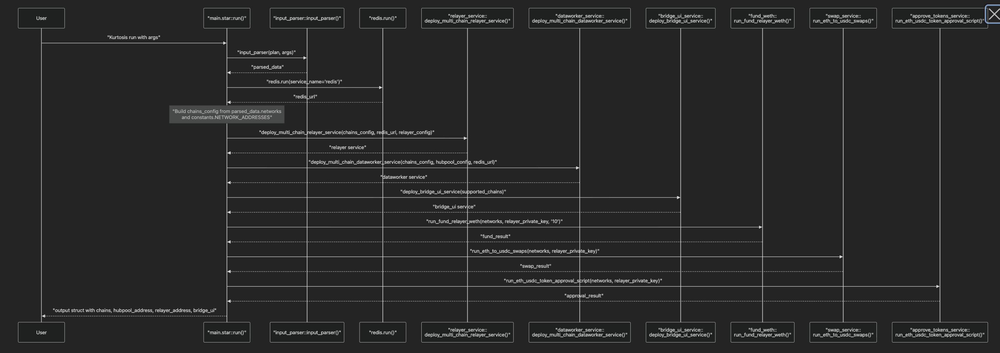

# Across Protocol Package - Technical Documentation

## Table of Contents
1. [Overview](#overview)
2. [Architecture](#architecture)
3. [Contract Deployment Component](#contract-deployment-component)
4. [Offchain Components](#offchain-components)
5. [Bridge UI Component](#bridge-ui-component)
6. [Configuration and Commands](#configuration-and-commands)
7. [Network Parameters](#network-parameters)
8. [Usage Examples](#usage-examples)

## Overview

The Across Protocol Package is a comprehensive Kurtosis package that implements a cross-chain transaction system based on the Across Protocol architecture. This package enables seamless asset transfers between different blockchain networks through a hub-and-spoke model with offchain relayers and dataworkers.

### Key Features
- **Multi-chain Support**: Supports Ethereum, Arbitrum, Optimism, Base, Polygon, BNB Chain, zkSync, Hedera, and Kadena networks
- **Automated Contract Deployment**: Deploys all necessary smart contracts across multiple chains
- **Offchain Infrastructure**: Includes relayer and dataworker services for cross-chain operations
- **Web UI**: Provides a bridge interface for users to initiate cross-chain transfers
- **Testnet Ready**: Configured for testnet environments with proper token support

## Architecture

The Across Protocol package follows a hub-and-spoke architecture where:

- **Hub Pool**: Central liquidity pool deployed on Ethereum (mainnet/testnet)
- **Spoke Pools**: Individual pools deployed on each supported chain
- **Relayer Service**: Monitors deposits and executes fills across chains
- **DataWorker Service**: Manages dispute resolution and merkle root updates
- **Bridge UI**: Web interface for user interactions

### System Architecture Diagram




### Deployment Process

The contract deployment is handled by the `deployer.star` module and follows this sequence:

1. **Hub Network Deployment** (Ethereum mainnet/testnet):
   - WETH token
   - LpTokenFactory
   - Finder contract
   - Adapter contract
   - HubPool (central liquidity pool)
   - SpokePool implementation and proxy
   - Address whitelist
   - Bond token
   - Store contract

2. **Spoke Network Deployment** (All other chains):
   - WETH/Wrapped tokens
   - Adapter contracts
   - SpokePool implementation and proxy

### Deployment Scripts

Located in `services/contracts/across-contracts/script/`:

- `DeployWETH.s.sol` - WETH token deployment
- `DeployLpTokenFactory.s.sol` - LP token factory
- `DeployFinder.s.sol` - Registry finder contract
- `DeployAdapter.s.sol` - Adapter for hub-spoke communication
- `DeployHubPool.s.sol` - Central liquidity pool
- `DeploySpokePoolImpl.s.sol` - SpokePool implementation
- `DeploySpokePoolProxy.s.sol` - SpokePool proxy
- `DeployAddressWhitelist.s.sol` - Address whitelist
- `DeployBondToken.s.sol` - Bond token for disputes
- `DeployStore.s.sol` - Data storage contract

### Special Network Handling

- **Kadena Networks**: Uses specialized deployment scripts with `foundry-chainweb`
- **Standard Networks**: Uses standard Foundry deployment with different gas strategies

### Contract Registration

After deployment, spoke pools are automatically registered with the HubPool through the `pool_registration.star` module.

## Offchain Components

### Relayer Service

**Purpose**: Monitors deposit events and executes fills across different chains.


**Configuration**:
```javascript
{
  "relayer_private_key": "0x...",
  "polling_interval": "5000", // ms
  "block_range": "100",
  "repayment_address": "0x..."
}
```

**Functionality**:
- Monitors `DepositV3` events on all configured chains
- Executes fills when deposits are detected
- Manages cross-chain token transfers
- Handles repayment and fee collection

**Environment Variables**:
- `CHAINS_CONFIG`: JSON configuration for all supported chains
- `REDIS_URL`: Redis connection for state management
- `RELAYER_PRIVATE_KEY`: Private key for transaction signing
- `POLLING_INTERVAL`: Block polling frequency
- `BLOCK_RANGE`: Number of blocks to scan per poll

### DataWorker Service

**Purpose**: Manages dispute resolution, merkle root updates, and cross-chain data synchronization.


**Configuration**:
```javascript
{
  "hubpool_rpc": "https://...",
  "hubpool_private_key": "0x...",
  "hubpool_address": "0x...",
  "polling_interval": "10000", // ms
  "block_range": "100",
  "min_refund_volume": "0"
}
```

**Functionality**:
- Monitors HubPool for new merkle roots
- Manages dispute resolution processes
- Updates spoke pools with new merkle roots
- Handles refund processing
- Maintains cross-chain state consistency

**Environment Variables**:
- `HUBPOOL_RPC`: HubPool RPC endpoint
- `HUBPOOL_PRIVATE_KEY`: Private key for HubPool interactions
- `HUBPOOL_ADDRESS`: HubPool contract address
- `CHAINS_CONFIG`: Chain configurations
- `REDIS_URL`: Redis connection
- `POLLING_INTERVAL`: Polling frequency
- `BLOCK_RANGE`: Block scanning range
- `MIN_REFUND_VOLUME`: Minimum refund threshold

### Redis Service

**Purpose**: Provides shared state management between relayer and dataworker services.

**Configuration**:
- Image: `redis:7`
- Memory: 64-256MB
- Persistent: No (ephemeral for testing)

## Bridge UI Component

### Purpose
Provides a web-based interface for users to initiate cross-chain transfers.

### Configuration
The UI is configured with chain metadata including:
- Chain names and IDs
- RPC endpoints
- Token information (symbols, decimals, addresses)
- SpokePool addresses
- Router addresses (for DEX integration)

### Supported Chains Configuration
```javascript
{
  "name": "Ethereum Sepolia",
  "chain_id": 11155111,
  "network_type": "ethereum_sepolia",
  "rpc": "https://sepolia.infura.io/v3/...",
  "spokepool_address": "0x...",
  "native_currency": {
    "name": "Ether",
    "symbol": "ETH",
    "decimals": 18
  },
  "tokens": [
    {
      "symbol": "WETH",
      "name": "Wrapped Ether",
      "decimals": 18,
      "address": "0x..."
    }
  ]
}
```

### Features
- Cross-chain token transfers
- Real-time balance checking
- Transaction status monitoring
- Multi-chain wallet connectivity

## Configuration and Commands

### Network Parameters Configuration

The package uses `network_params.yaml` for configuration:

```yaml
networks:
  - name: "Ethereum Sepolia"
    type: "ethereum_sepolia"
    chain_id: "11155111"
    rpc: https://sepolia.infura.io/v3/...
    private_key: 0x...

dataworker:
  network_type: "ethereum_sepolia"
  chain_id: "11155111"
  hubpool_rpc: https://sepolia.infura.io/v3/...

deploy_contract: false
```

### Available Commands

#### 1. Package Execution
```bash
kurtosis run github.com/0xBloctopus/across-package
```

#### 2. E2E Testing
```bash
./e2e_deposit.sh a2b  # Ethereum Sepolia to Kadena
./e2e_deposit.sh b2a  # Kadena to Ethereum Sepolia
```

#### 3. Token Operations
```bash
# Fund relayer with WETH
./services/fund_weth.star

# Swap ETH to USDC
./services/swap_tokens.star

# Approve tokens for SpokePool
./services/approve_tokens.star
```

### Service Management

#### Start Services
```bash
kurtosis service start <service-name>
```

#### View Logs
```bash
kurtosis service logs <service-name>
```

#### Stop Services
```bash
kurtosis service stop <service-name>
```

## Network Parameters

### Supported Network Types

1. **Ethereum Mainnet** (`ethereum_mainnet`)
2. **Ethereum Sepolia** (`ethereum_sepolia`)
3. **Arbitrum Mainnet** (`arbitrum_mainnet`)
4. **Optimism Mainnet** (`optimism_mainnet`)
5. **Base Mainnet** (`base_mainnet`)
6. **Polygon Mainnet** (`polygon_mainnet`)
7. **BNB Chain** (`bnb_mainnet`)
8. **zkSync Mainnet** (`zksync_mainnet`)
9. **Hedera Testnet** (`hedera`)
10. **Kadena Testnet** (`kadena`)

### Network Configuration Parameters

Each network requires:
- `name`: Human-readable network name
- `type`: Network type identifier
- `chain_id`: Blockchain chain ID
- `rpc`: RPC endpoint URL
- `private_key`: Deployment/transaction signing key

### Token Configuration

Each network supports:
- Native currency (ETH, etc.)
- Wrapped tokens (WETH, etc.)
- ERC-20 tokens (USDC, etc.)
- Router addresses for DEX integration

### Relayer Configuration

```javascript
RELAYER_INFO = {
  "private_key": "0x...",
  "repayment_address": "0x...",
  "polling_interval": "5000",
  "block_range": "100"
}
```

### DataWorker Configuration

```javascript
DATAWORKER_INFO = {
  "private_key": "0x...",
  "polling_interval": "5000",
  "block_range": "100",
  "min_refund_volume": "0"
}
```

## Usage Examples

### 1. Deploy Contracts to Multiple Networks

Set `deploy_contract: true` in `network_params.yaml` and run:
```bash
kurtosis run github.com/0xBloctopus/across-package
```

### 2. Test Cross-Chain Transfer

After deployment, use the E2E script:
```bash
./e2e_deposit.sh a2b
```

### 3. Monitor Services

```bash
# Check relayer logs
kurtosis service logs across-relayer

# Check dataworker logs
kurtosis service logs across-dataworker

# Check bridge UI
kurtosis service logs bridge-ui
```

### 4. Access Bridge UI

Once deployed, the bridge UI will be available at the service hostname on port 80.

### 5. Custom Network Configuration

To add a new network:

1. Add network configuration to `network_params.yaml`
2. Update `constants.star` with network addresses and metadata
3. Add deployment scripts if needed
4. Update chain metadata in `CHAIN_METADATA`

This comprehensive setup provides a complete cross-chain bridge infrastructure that can be easily configured and deployed across multiple blockchain networks.
